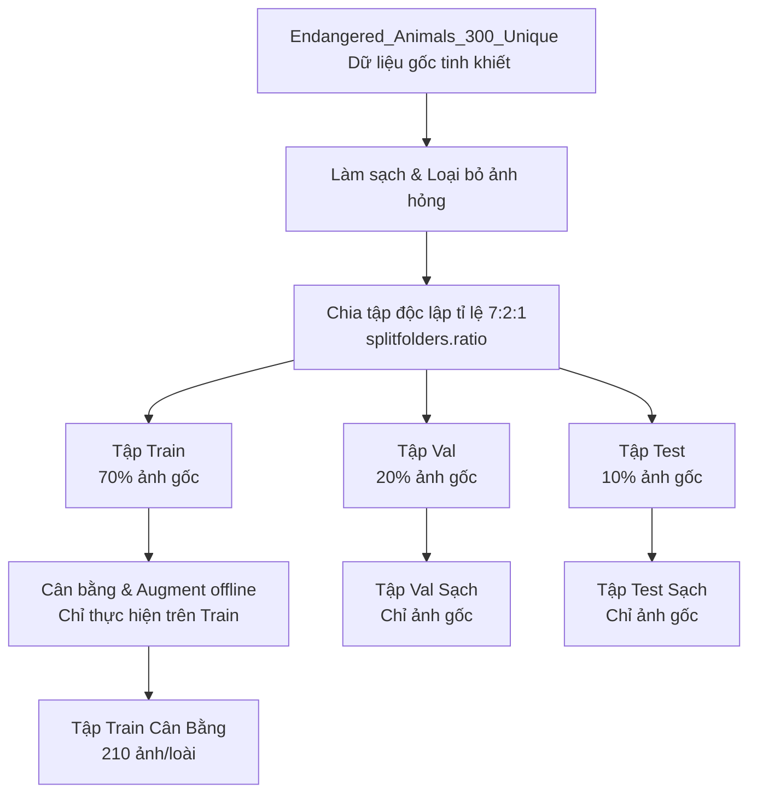

# BÁO CÁO KHOA HỌC: TIỀN XỬ LÝ DỮ LIỆU & KHẮC PHỤC DATA LEAKAGE TẬP DỮ LIỆU NHẬN DIỆN ĐỘNG VẬT SÁCH ĐỎ

**Môn học:** Deep Learning  
**Nhóm thực hiện:** Đặng Thành Thi (MSSV: 2001230918), Lưu Đức Linh (MSSV: 2001230444), Trần Xuân Hướng (MSSV: 2001230339)

---

## I. TỔNG QUAN VẤN ĐỀ VÀ THÁCH THỨC ĐẦU VÀO
Trong xây dựng các mô hình Học Sâu (Deep Learning), đặc biệt là phân loại hình ảnh thực tế, chất lượng dữ liệu đầu vào và tính toàn vẹn của quy trình xử lý dữ liệu (data pipeline hygiene) là yếu tố tiên quyết quyết định hiệu năng thực tế của mô hình. 

Tập dữ liệu ban đầu thu thập từ cào ảnh Bing (`Endangered_Animals_300_Unique`) gồm 9 lớp có sự mất cân bằng về số lượng ảnh (ví dụ: lớp *Hươu Sao* có 299 ảnh gốc, trong khi *Cu Li Nhỏ* chỉ có 148 ảnh). Việc cân bằng dữ liệu là bắt buộc, tuy nhiên nếu thực hiện không chuẩn mực sẽ dẫn đến các sai số nghiêm trọng về mặt lý thuyết toán học của Học Máy.

---

## II. KHẮC PHỤC LỖI HỌC THUẬT NGHIÊM TRỌNG: DATA LEAKAGE (RÒ RỈ DỮ LIỆU)

### 1. Phân Tích Lỗi Trong Pipeline Cũ
Ở phiên bản ban đầu, quy trình tiền xử lý được thiết kế như sau:
$$\text{Cào dữ liệu gốc} \rightarrow \textbf{Cân bằng & Augment trên thư mục gốc (canbang.py)} \rightarrow \textbf{Chia tập Train/Val/Test (tienxulyanh.py)}$$

* **Cơ chế lỗi:** Khi `canbang.py` chạy trực tiếp trên thư mục gốc, nó tạo ra các ảnh biến đổi (`AUG_...`) từ các ảnh gốc để đưa mọi lớp về đúng 300 ảnh. Khi `tienxulyanh.py` sử dụng hàm phân chia ngẫu nhiên `splitfolders.ratio` trên thư mục này, có xác suất rất cao là một ảnh gốc được xếp vào tập **Train**, trong khi phiên bản biến thể xoay/lật (`AUG_...`) của chính nó lại rơi vào tập **Validation** hoặc **Test**.
* **Hậu quả học thuật:** Đây là lỗi **Data Leakage (Rò rỉ dữ liệu)** kinh điển. Tập Val và Test không còn đóng vai trò đánh giá độc lập nữa mà đã bị ô nhiễm bởi thông tin từ tập Train. Điều này làm cho độ chính xác khi đánh giá (Validation/Test Accuracy) đạt mức ảo cực kỳ cao (~95% - 98%), nhưng khi đưa mô hình vào chạy thực tế trên các hình ảnh mới hoàn toàn, độ chính xác sẽ sụt giảm nghiêm trọng.

### 2. Thiết Kế Quy Trình Mới Đạt Chuẩn Khoa Học
Để giải quyết triệt để lỗi trên, nhóm đã cấu trúc lại hoàn toàn pipeline theo sơ đồ chuẩn mực:
$$\text{Làm sạch dữ liệu gốc} \rightarrow \textbf{Chia tập Train/Val/Test độc lập trước} \rightarrow \textbf{Chỉ cân bằng & Augment trên tập Train con}$$



* **Ưu điểm vượt trội:** 
  - Tập Validation và Test hoàn toàn chỉ chứa ảnh gốc thực tế mà mô hình chưa bao giờ tiếp cận dưới bất kỳ dạng thức nào (không chứa ảnh augment).
  - Độ chính xác đánh giá phản ánh chính xác 100% khả năng tổng quát hóa (generalization) của mô hình.

---

## III. LÀM SẠCH DỮ LIỆU & LOẠI BỎ THÀNH PHẦN HỎNG (DATA CLEANING)

Trước khi tiến hành phân chia dữ liệu, nhóm đã phát triển script tự động `clean_dataset.py` để quét toàn bộ dữ liệu thô:
1. **Xóa bỏ các ảnh Augment cũ:** Xóa hoàn toàn 670 ảnh có tiền tố `AUG_...` khỏi thư mục gốc để thu hồi dữ liệu gốc tinh khiết gồm **2030 ảnh**.
2. **Khắc phục lỗi crash định dạng:** Phát hiện và xóa ảnh `clouded-leopard-neofelis-nebulosa-art-wolfe.jpg` trong thư mục `Bao_Gam`. Ảnh này bị lỗi cấu trúc dữ liệu nhị phân (corrupted bytes) khiến thư viện `PIL.Image` không thể mở được. Việc loại bỏ tệp hỏng này giúp ngăn ngừa hoàn toàn các lỗi dừng đột ngột (crash/broken pipe) của PyTorch DataLoader khi đang huấn luyện.

---

## IV. PHÂN PHỐI THỐNG KÊ TẬP DỮ LIỆU SAU CẢI TIẾN

Dữ liệu gốc (2029 ảnh sau khi xóa 1 ảnh lỗi) được chia theo tỉ lệ chuẩn **7:2:1**:

* **Tập Huấn luyện (Train) - 70%:** Được áp dụng thuật toán Augment offline (Xoay ngẫu nhiên $\pm 15^\circ$, lật ngang, hiệu chỉnh sáng tối $15\%$) để nâng số lượng ảnh của mọi lớp lên đồng đều **210 ảnh/loài** (70% của mục tiêu 300 ảnh/loài ban đầu). Tổng số ảnh tập Train là **1890 ảnh**.
* **Tập Kiểm thử (Val) - 20%:** Giữ nguyên trạng thái ảnh gốc tinh khiết để tinh chỉnh siêu tham số và lưu trọng số tốt nhất. Tổng số ảnh: **402 ảnh**.
* **Tập Đánh giá độc lập (Test) - 10%:** Giữ nguyên trạng thái ảnh gốc tinh khiết để đánh giá hiệu năng cuối cùng của mô hình. Tổng số ảnh: **210 ảnh**.

### Bảng Thống Kê Chi Tiết Phân Phối Lớp Dữ Liệu:

| Tên Loài Động Vật | Dữ liệu gốc tinh khiết | Tập Train Gốc | Tập Train Sau Augment | Tập Validation Gốc | Tập Test Gốc |
| :--- | :---: | :---: | :---: | :---: | :---: |
| **Báo Gấm** | 192 | 134 | **210** | 38 | 20 |
| **Cu Li Nhỏ** | 148 | 103 | **210** | 29 | 16 |
| **Gấu Ngựa** | 220 | 154 | **210** | 44 | 22 |
| **Hổ Đông Dương** | 240 | 168 | **210** | 48 | 24 |
| **Hươu Sao** | 299 | 209 | **210** | 59 | 31 |
| **Tê Tê Java** | 191 | 133 | **210** | 38 | 20 |
| **Voi Châu Á** | 288 | 201 | **210** | 57 | 30 |
| **Voọc Chà Vá** | 202 | 141 | **210** | 40 | 21 |
| **Vượn Má Vàng** | 249 | 174 | **210** | 49 | 26 |
| **TỔNG CỘNG** | **2029** | **1417** | **1890** | **402** | **210** |

---

## V. CÁC PHƯƠNG PHÁP CÂN BẰNG DỮ LIỆU NÂNG CAO ĐÃ TRIỂN KHAI

Để tối ưu hóa kiến thức môn học Deep Learning, nhóm đã tích hợp và sẵn sàng trình bày trước hội đồng hai phương pháp cân bằng lớp nâng cao:

### Phương Pháp 1: Cân Bằng Offline Trên Đĩa Cứng (Đang Chọn Mặc Định)
* **Cơ chế:** Tạo ra các ảnh biến thể vật lý lưu trên đĩa cứng cho tập `train` của các lớp thiểu số để đạt đúng 210 ảnh/lớp.
* **Đặc tính:** Trực quan, dễ quan sát phân bố thư mục, đảm bảo hàm mất mát `CrossEntropyLoss` nhận số mẫu đồng đều trên mỗi Epoch.

### Phương Pháp 2: Cân Bằng Online Trong RAM Bằng `WeightedRandomSampler` (Tùy Chọn Độc Độc Đáo)
* **Cơ chế:** Nhóm đã thiết lập sẵn đoạn code mẫu trong `train_resnet18_full.py` sử dụng bộ lấy mẫu có trọng số của PyTorch:
  $$W_c = \frac{1}{N_c}$$
  Trong đó $N_c$ là số lượng ảnh gốc của lớp $c$ trong tập Train. Mỗi ảnh trong tập dữ liệu sẽ nhận một trọng số tương ứng với lớp của nó:
  $$w_i = W_{c(i)}$$
  Bộ nạp dữ liệu `DataLoader` sẽ lấy mẫu ngẫu nhiên có lặp lại dựa trên phân phối xác suất tỉ lệ thuận với $w_i$.
* **Ưu điểm lý thuyết:**
  - Tiết kiệm bộ nhớ lưu trữ đĩa cứng tối đa.
  - Kết hợp với online augmentation (`transforms.Compose`), mỗi lần mô hình lặp lại (sampling with replacement) một bức ảnh cũ, bức ảnh đó sẽ được biến đổi ngẫu nhiên thành một phiên bản hoàn toàn mới trong RAM.
  - Ngăn ngừa overfitting vượt trội so với việc lưu ảnh biến thể cố định trên đĩa cứng.

---

## VI. NÂNG CẤP BỘ BIẾN ĐỔI ẢNH ONLINE (DATA AUGMENTATION PIPELINE)

Nhóm đã bổ sung thêm các phép biến đổi hình ảnh động trực tiếp khi huấn luyện vào `data_transforms` của tập Train trong PyTorch:
```python
transforms.RandomRotation(15)                        # Xoay ngẫu nhiên từ -15 đến 15 độ
transforms.ColorJitter(brightness=0.2, contrast=0.2)  # Thay đổi ngẫu nhiên độ sáng và độ tương phản
```
* **Ý nghĩa thực tế:** Giúp mô hình ResNet-18 thích ứng tốt hơn với các điều kiện thực địa (như ảnh camera trap chụp đêm thiếu sáng, hoặc con vật di chuyển nghiêng góc), tăng độ chính xác của ứng dụng Desktop và Streamlit khi nhận diện các vật thể lạ ngoài tự nhiên.
