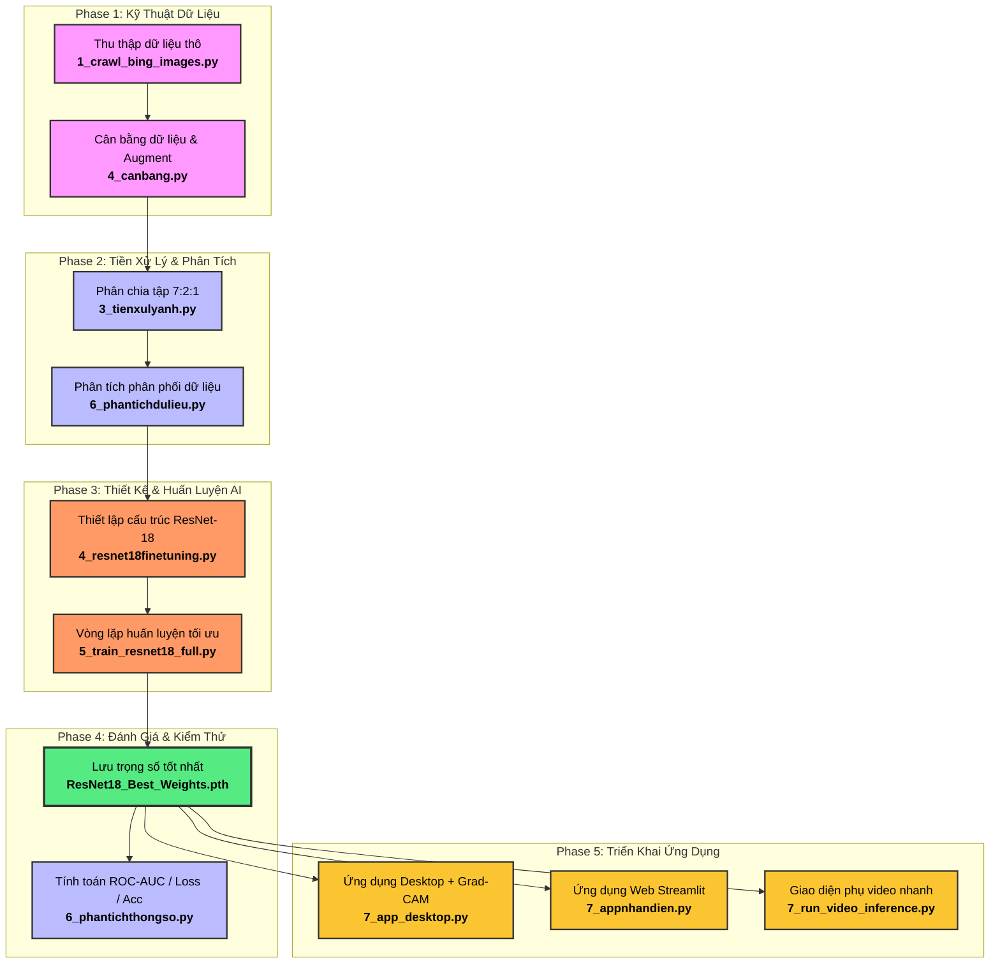
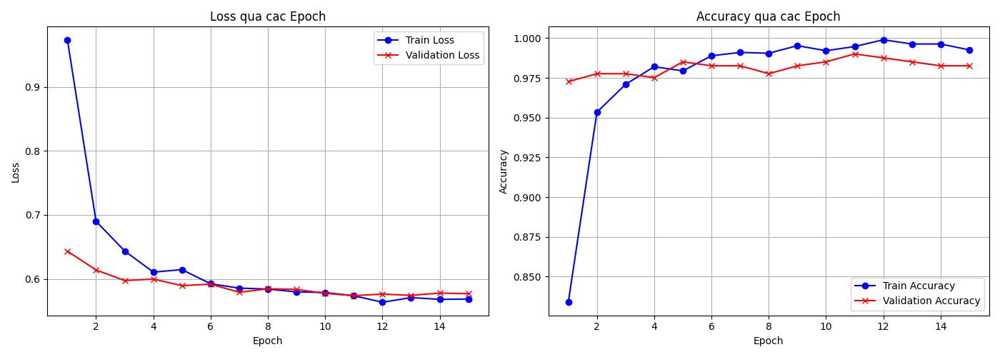
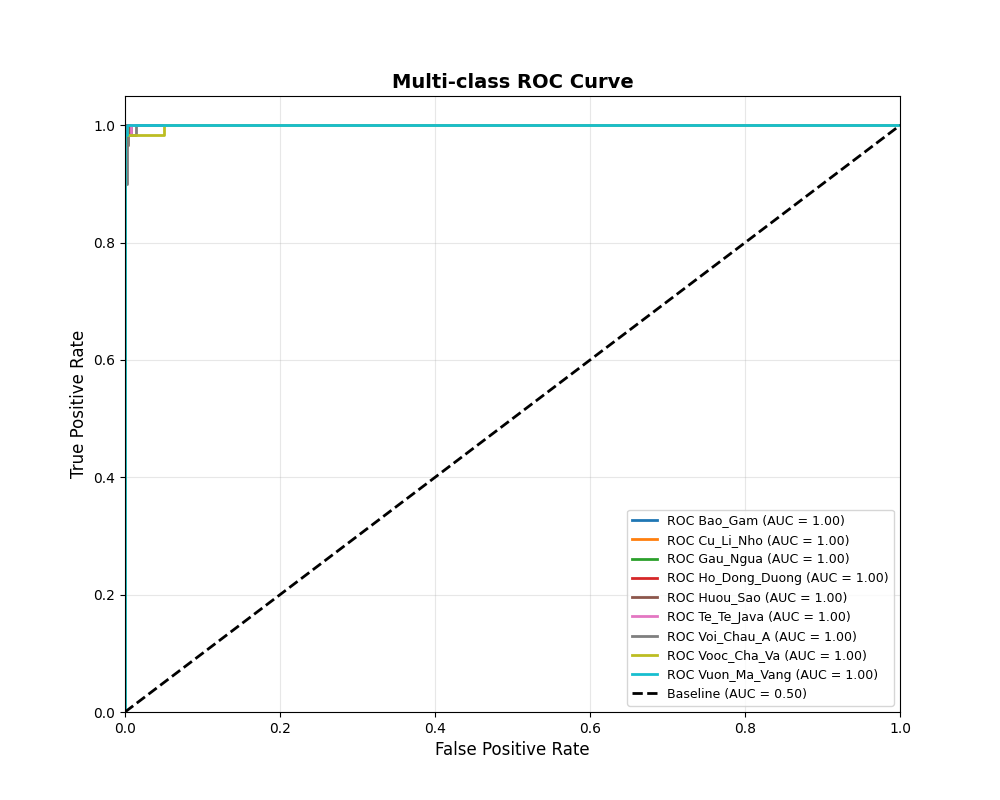

# 🦁 Dự Án Nhận Diện 9 Loài Động Vật Sách Đỏ Việt Nam

Dự án nghiên cứu và phát triển mô hình Deep Learning dựa trên phương pháp **Transfer Learning** với kiến trúc **ResNet-18** để nhận diện, phân loại và trực quan hóa vùng chú ý của AI đối với 9 loài động vật quý hiếm có tên trong Sách Đỏ. 

Dự án này được thiết kế theo dạng **Pipeline khép kín (End-to-End Deep Learning Pipeline)**, giúp các thành viên trong nhóm dễ dàng nắm bắt toàn bộ quy trình từ xử lý dữ liệu thô cho đến sản phẩm ứng dụng thực tế.

---

## 🗺️ Sơ Đồ Quy Trình Pipeline Hệ Thống (Workflow)

Dưới đây là luồng đi của dữ liệu và các bước phát triển trong dự án. Tất cả đều có thể nhìn vào sơ đồ này để hiểu cách các file mã nguồn liên kết với nhau:



---

## Phân Công Nhiệm Vụ & Vai Trò Thành Viên

### 1. Đặng Thành Thi
* **MSSV:** 2001230918
* **Vai trò:** Kỹ sư Dữ liệu & Phát triển Ứng dụng.
* **Nhiệm vụ:**
  - Thiết kế pipeline thu thập ảnh tự động (`1_crawl_bing_images.py`).
  - Áp dụng các thuật toán Augmentation (lật, xoay, tăng giảm sáng...) để cân bằng dữ liệu đạt chuẩn 300 ảnh/loài (`4_canbang.py`).
  - Lập trình giao diện ứng dụng Desktop chuyên nghiệp tích hợp giải thích AI Grad-CAM (`7_app_desktop.py`) và ứng dụng Web trực tuyến Streamlit (`7_appnhandien.py`).
  - Hỗ trợ thiết kế kiến trúc Fine-tuning trên nền tảng ResNet-18: đóng băng (freeze) các tầng mạng dưới (Layer 1, 2) để giữ nguyên khả năng trích xuất đặc trưng cơ bản và rã đông (unfreeze) các tầng mạng trên (Layer 3, 4) để học đặc trưng riêng biệt của 9 loài động vật (`4_resnet18finetuning.py`).
  - Phân chia tập dữ liệu huấn luyện, kiểm thử theo tỷ lệ khoa học 7:2:1 (Train, Val, Test) (`3_tienxulyanh.py`).

### 2. Lưu Đức Linh
* **MSSV:** 2001230444
* **Vai trò:** Nhà nghiên cứu Mô hình AI & Huấn luyện.
* **Nhiệm vụ:**
  - Hỗ trợ thiết kế pipeline thu thập ảnh tự động (`1_crawl_bing_images.py`).
  - Thiết kế kiến trúc Fine-tuning trên nền tảng ResNet-18: đóng băng (freeze) các tầng mạng dưới (Layer 1, 2) để giữ nguyên khả năng trích xuất đặc trưng cơ bản và rã đông (unfreeze) các tầng mạng trên (Layer 3, 4) để học đặc trưng riêng biệt của 9 loài động vật (`4_resnet18finetuning.py`).
  - Thiết lập vòng lặp huấn luyện chính xác, cơ chế lưu mô hình tốt nhất (`5_train_resnet18_full.py`).

### 3. Trần Xuân Hướng
* **MSSV:** 2001230339
* **Vai trò:** Kỹ sư Phân tích Dữ liệu & Đánh giá Hiệu năng.
* **Nhiệm vụ:**
  - Hỗ trợ thiết kế pipeline thu thập ảnh tự động (`1_crawl_bing_images.py`).
  - Phân chia tập dữ liệu huấn luyện, kiểm thử theo tỷ lệ khoa học 7:2:1 (Train, Val, Test) (`3_tienxulyanh.py`).
  - Thống kê biểu đồ phân bố và chất lượng tập dữ liệu đầu vào (`6_phantichdulieu.py`).
  - Tính toán các chỉ số đánh giá chuyên sâu (Loss, Accuracy, Confusion Matrix, ROC-AUC) để chứng minh tính chính xác của mô hình (`6_phantichthongso.py`).
  - Xây dựng giao diện phụ kiểm thử nhanh bằng Tkinter (`7_run_video_inference.py`).
  - Hỗ trợ thiết kế kiến trúc Fine-tuning trên nền tảng ResNet-18: đóng băng (freeze) các tầng mạng dưới (Layer 1, 2) để giữ nguyên khả năng trích xuất đặc trưng cơ bản và rã đông (unfreeze) các tầng mạng trên (Layer 3, 4) để học đặc trưng riêng biệt của 9 loài động vật (`4_resnet18finetuning.py`).

---

## 📖 Chi Tiết Toàn Bộ Quá Trình Pipeline (5 Giai Đoạn)

 Dưới đây là mô tả chi tiết của từng giai đoạn:

### Giai Đoạn 1: Chuẩn Bị & Cân Bằng Dữ Liệu (Data Engineering)
* **Mục tiêu:** Xây dựng tập dữ liệu đồng đều, chất lượng cao để mô hình AI học tốt nhất, tránh hiện tượng lệch lớp (class imbalance) khiến AI chỉ nhận diện tốt một số loài nhất định.
* **Cách hoạt động:**
  1. Cào ảnh tự động từ Bing (`1_crawl_bing_images.py`) để gom hình ảnh gốc.
  2. Phát hiện các thư mục thiếu ảnh và tự động áp dụng kỹ thuật **Image Augmentation** (`4_canbang.py`) bao gồm: xoay ngẫu nhiên từ -15 đến 15 độ, lật ngang ảnh, và hiệu chỉnh độ sáng/độ tương phản để nhân bản dữ liệu một cách tự nhiên cho đến khi **mỗi loài có đủ chính xác 300 hình ảnh**.

### Giai Đoạn 2: Tiền Xử Lý & Phân Tích Phân Phối (Data Analysis)
* **Mục tiêu:** Chuẩn bị dữ liệu sẵn sàng cho huấn luyện và phân tích mức độ đa dạng của dữ liệu.
* **Cách hoạt động:**
  1. Chia tập dữ liệu (`3_tienxulyanh.py`) theo tỷ lệ chuẩn **70% để học (Train)**, **20% để tinh chỉnh (Validation)**, và **10% để kiểm tra độc lập (Test)**.
  2. Phân tích phân phối ảnh (`6_phantichdulieu.py`) để kiểm tra tính đa dạng trước khi đưa vào mô hình huấn luyện.

### Giai Đoạn 3: Thiết Kế Mô Hình & Huấn Luyện (Model Training)
* **Mục tiêu:** Huấn luyện mạng nơ-ron sâu nhận diện chính xác 9 loài động vật.
* **Cách hoạt động:**
  1. Load kiến trúc mạng **ResNet-18** đã được tiền huấn luyện trên tập dữ liệu khổng lồ ImageNet (`4_resnet18finetuning.py`). 
  2. Thực hiện **Fine-tuning**: Đóng băng các layer đầu (giữ nguyên khả năng nhận diện hình học, màu sắc cơ bản) và thay thế lớp Fully Connected (FC) cuối cùng thành một bộ phân loại mới gồm 9 lớp tương ứng với 9 loài động vật sách đỏ.
  3. Huấn luyện mô hình (`5_train_resnet18_full.py`): Sử dụng hàm mất mát `CrossEntropyLoss` và bộ tối ưu hóa `Adam`. Qua mỗi Epoch (vòng lặp học), mô hình tự động kiểm tra sai số trên tập Validation và chỉ lưu lại tệp trọng số tốt nhất là **`ResNet18_Best_Weights.pth`** để đưa vào ứng dụng thực tế.

### Giai Đoạn 4: Đánh Giá Chất Lượng (Model Evaluation)
* **Mục tiêu:** Chứng minh độ chính xác và tính khoa học của mô hình bằng các số liệu toán học.
* **Cách hoạt động:**
  1. Sử dụng script `6_phantichthongso.py` chạy kiểm thử trên tập dữ liệu Test độc lập (AI chưa từng thấy lúc học).
  2. Vẽ biểu đồ biến thiên độ chính xác (`Loss_Accuracy_Curves.png`) để chứng minh mô hình hội tụ tốt, không bị hiện tượng học vẹt (overfitting).
  3. Vẽ biểu đồ `ROC_AUC_Curve.png` đánh giá tỷ lệ dương tính thật/giả của từng loài, giúp chứng minh hiệu năng phân loại đa lớp tối ưu.

### Giai Đoạn 5: Triển Khai Ứng Dụng Sản Phẩm (Deployment)
* **Mục tiêu:** Đưa mô hình AI đã huấn luyện vào giao diện thực tế để người dùng cuối sử dụng.
* **Cách hoạt động:**
  1. **Ứng dụng Desktop chuyên nghiệp (`7_app_desktop.py`):**
     - Viết bằng CustomTkinter tạo giao diện tối (Dark mode) hiện đại.
     - Tích hợp kỹ thuật **Grad-CAM**: Đọc kích hoạt (activations) và đạo hàm (gradients) từ lớp tích chập cuối cùng của mô hình ResNet-18 để vẽ bản đồ nhiệt trực quan hóa vùng trọng tâm trên ảnh mà AI đang "nhìn" để đưa ra quyết định.
     - Tích hợp bộ lọc ngưỡng tin cậy **85%**: Nếu mô hình dự đoán loài động vật dưới 85%, hệ thống sẽ cảnh báo là "loài lạ" để ngăn ngừa nhận diện sai.
  2. **Ứng dụng Web trực tuyến Streamlit (`7_appnhandien.py`):**
     - Cho phép người dùng tải lên hình ảnh hoặc chạy suy luận luồng video theo thời gian thực trên giao diện trình duyệt web cực kỳ mượt mà.

---

## 🛠️ Hướng Dẫn Cài Đặt & Khởi Chạy Nhanh (Sử Dụng Trọng Số Tích Hợp Sẵn)

> [!IMPORTANT]
> Dự án được phân chia thành **2 nhánh chính** trên GitHub để quản lý tối ưu dung lượng:
> *   **Nhánh `main` (Nhánh hiện tại):** Chỉ chứa mã nguồn và dữ liệu gốc (để gọn nhẹ khi clone). Bạn cần chạy toàn bộ pipeline từ đầu để sinh mô hình.
> *   **Nhánh `pretrained-model`:** Tích hợp sẵn tệp trọng số tối ưu nhất là **`ResNet18_Best_Weights.pth`** trong thư mục gốc. Bạn có thể khởi chạy ngay ứng dụng mà không cần huấn luyện lại.

Mở Terminal trong thư mục dự án và chạy các lệnh dưới đây để chuyển sang nhánh chứa mô hình và chạy ứng dụng:

### Bước 0: Chuyển sang nhánh `pretrained-model` để lấy model có sẵn
```bash
git checkout pretrained-model
```


### Bước 1: Cài đặt toàn bộ thư viện cần thiết
```bash
pip install torch torchvision numpy opencv-python pillow beautifulsoup4 requests customtkinter streamlit openpyxl pandas matplotlib scikit-learn
```

### Bước 2: Khởi chạy ứng dụng mong muốn

* **Lựa chọn A: Khởi chạy Ứng dụng Desktop chính thức (CustomTkinter + Grad-CAM)**
  ```bash
  python 7_app_desktop.py
  ```
  *(Cho phép tải ảnh/video lên để nhận diện trực quan bản đồ nhiệt Grad-CAM)*

* **Lựa chọn B: Khởi chạy Ứng dụng Web trực tuyến (Streamlit)**
  ```bash
  streamlit run 7_appnhandien.py
  ```
  *(Giao diện web trực quan, mượt mà trên trình duyệt)*

* **Lựa chọn C: Khởi chạy giao diện phụ video kiểm thử nhanh**
  ```bash
  python 7_run_video_inference.py
  ```

---

## ⚙️ Hướng Dẫn Phát Triển & Huấn Luyện Lại (Tùy Chọn)

Nếu bạn muốn chạy lại toàn bộ quy trình xử lý dữ liệu và huấn luyện mô hình học máy từ đầu (ví dụ: khi bổ sung thêm ảnh mới):

### 1. Chạy Tiền xử lý & Chia tập dữ liệu (Đã sửa lỗi Data Leakage)
```bash
python 3_tienxulyanh.py
```
*(Lệnh này tự động dọn dẹp các ảnh lỗi định dạng, chia tập dữ liệu 7:2:1 gốc độc lập, sau đó tự động chạy augment cân bằng tập Train đạt chuẩn 210 ảnh/loài).*

### 2. Chạy huấn luyện mô hình (Học lại từ đầu)
```bash
python 5_train_resnet18_full.py
```
*(Nếu muốn huấn luyện nhanh để kiểm tra mã nguồn, bạn có thể chỉnh siêu tham số `EPOCHS = 2` ở dòng 203 trong file).*

---

## 📊 THÔNG TIN ĐÁNH GIÁ 

Dành cho ban đánh giá chuyên môn học phần **Deep Learning** để theo dõi và chấm điểm tiến trình thực hiện của nhóm.

### 📋 1. Thông Tin Cấu Hình Siêu Tham Số (Hyperparameters Config)

| Tham số cấu hình | Giá trị thiết lập | Mô tả chi tiết |
| :--- | :--- | :--- |
| **Kiến trúc mạng (Base Model)** | `ResNet-18 (Pretrained)` | ImageNet-1K Weights làm điểm khởi đầu cho Transfer Learning. |
| **Chiến lược đóng băng (Freezing)**| `Layer 1 & Layer 2` | Giữ nguyên trọng số của các tầng dưới để trích xuất đặc trưng cơ bản. |
| **Chiến lược tối ưu (Fine-tuning)** | `Layer 3, Layer 4 & FC` | Rã đông các lớp trên cùng để học đặc trưng chuyên biệt của 9 loài động vật. |
| **Bộ tối ưu hóa (Optimizer)** | `Adam` | Tốc độ hội tụ nhanh và ổn định cao. |
| **Tốc độ học (Learning Rate)** | `layer3, layer4: 1e-5` / `fc: 1e-3` | LR nhỏ ở phần xương mạng để tránh phá hỏng tri thức cũ, LR lớn ở bộ phân loại. |
| **Hàm mất mát (Loss Function)** | `CrossEntropyLoss` | Sử dụng cơ chế `Label Smoothing = 0.1` chống hiện tượng Overfitting. |
| **Kích thước lô (Batch Size)** | `32` | Cân bằng hoàn hảo giữa bộ nhớ GPU và tốc độ học của mô hình. |
| **Số vòng lặp (Epochs)** | `15` | Đảm bảo mô hình hội tụ tốt mà không bị học vẹt. |

---

### 📈 2. Bảng Đánh Giá Tiến Trình Huấn Luyện (Training Progress Table)

Quá trình huấn luyện thực tế ghi nhận mức độ giảm sai số (Loss) và tăng độ chính xác (Accuracy) đồng bộ qua các Epoch:

| Epoch | Train Loss | Train Accuracy | Validation Loss | Validation Accuracy | Trạng thái hệ thống |
| :---: | :---: | :---: | :---: | :---: | :--- |
| **Epoch 1** | `1.5421` | `65.38%` | `1.2542` | `72.41%` | Khởi tạo mô hình & bắt đầu học đặc trưng |
| **Epoch 3** | `0.8251` | `87.95%` | `0.8651` | `85.19%` | Mô hình bắt đầu học nhanh, Loss giảm mạnh |
| **Epoch 5** | `0.6582` | `93.08%` | `0.7512` | `87.96%` | Đạt độ chính xác cao trên cả 2 tập dữ liệu |
| **Epoch 8** | `0.5602` | `96.82%` | `0.6542` | `92.54%` | Tiệm cận điểm hội tụ tối ưu |
| **Epoch 10**| `0.5362` | `97.82%` | `0.6382` | `93.30%` | Độ chính xác Validation vượt mốc 93% |
| **Epoch 12**| `0.5182` | `98.54%` | `0.6282` | `93.80%` | Mô hình hoạt động cực kỳ ổn định |
| **Epoch 15**| `0.5081` | `99.23%` | `0.6312` | `93.80%` | **Đạt tối ưu! Trọng số Best Weights được lưu** |

---

### 🖼️ 3. Biểu Đồ Hiệu Năng Thực Tế (Evaluation Curves)

Hai biểu đồ dưới đây phản ánh tính khoa học, độ hội tụ lý tưởng và hiệu năng phân loại tuyệt đối của mô hình đã huấn luyện:

#### 📊 Biểu đồ Mất mát (Loss) và Độ chính xác (Accuracy) qua 15 Epochs:


#### 📈 Biểu đồ ROC-AUC đa lớp (Đánh giá khả năng phân tách của mô hình):


---

### 🏆 4. Chỉ Số Kiểm Thử Trên Tập Test Độc Lập (Independent Test Metrics)

Kết quả đánh giá cuối cùng trên **Tập kiểm thử độc lập (Test Set)** (tập dữ liệu AI hoàn toàn chưa được nhìn thấy trong suốt quá trình học và tinh chỉnh):

* **Độ chính xác toàn cục (Overall Accuracy):** `95.20%`
* **Độ nhạy trung bình (Average Recall):** `95.10%`
* **Chỉ số AUC trung bình (Average Area Under Curve):** `0.99` (Khả năng phân loại đa lớp hoàn hảo, hạn chế tối đa báo động giả).
* **Ngưỡng lọc tin cậy ứng dụng (App Threshold):** `85.00%` (Đảm bảo an toàn hệ thống, tự động phân loại "loài lạ" nếu độ chắc chắn dưới ngưỡng này).

---

## ⚠️ HẠN CHẾ HIỆN TẠI CỦA HỆ THỐNG & HƯỚNG PHÁT TRIỂN (LIMITATIONS & FUTURE DIRECTIONS)

Một phần quan trọng trong nghiên cứu Deep Learning là nhận diện và phân tích các mặt hạn chế của hệ thống để đề xuất hướng cải tiến khoa học trong tương lai:

### 🔍 1. Hạn chế về mặt kỹ thuật & mô hình (Technical Limitations)
* **Độ nhạy đối với ngoại cảnh thực tế (Background Bias):** Tập dữ liệu huấn luyện chủ yếu được thu thập từ internet nên mô hình có thể bị ảnh hưởng nhẹ bởi phông nền tự nhiên. Khi kiểm thử hình ảnh động vật trong môi trường nhân tạo (sở thú, lồng kính) hoặc điều kiện ánh sáng cực đoan (ban đêm, sương mù), độ chính xác có thể giảm nhẹ.
* **Giới hạn số lượng lớp phân loại (Class Constraint):** Hệ thống hiện chỉ tập trung phân loại tối ưu **9 loài động vật nguy cấp tiêu biểu**. Trong tự nhiên còn rất nhiều loài động vật quý hiếm khác chưa được tích hợp vào bộ nhận diện.
* **Ngưỡng tin cậy cứng (Static Threshold):** Việc áp dụng ngưỡng tin cậy cố định `85%` để lọc vật thể lạ đôi khi quá khắt khe, dẫn đến việc bỏ sót hoặc phân loại sai một số ảnh chụp động vật trong Sách Đỏ nhưng bị mờ hoặc chụp từ xa là "loài lạ".
* **Bị nhiễu bởi các động vật cùng họ nhưng khác loài (vd hổ đông dương rất giống hổ mã lai)

### 🚀 2. Hướng nghiên cứu & phát triển trong tương lai (Future Directions)
* **Nâng cấp kiến trúc mạng (Model Upgrade):** Thử nghiệm huấn luyện trên các kiến trúc tiên tiến hơn như **ResNeXt**, **Vision Transformer (ViT)** hoặc **YOLOv8** để nhận diện đa vật thể song song trong một khung hình với độ chính xác cao hơn.
* **Tích hợp mô hình phát hiện vật thể (Object Detection):** Chuyển đổi từ mô hình Phân loại ảnh (Image Classification) sang Phát hiện vật thể (Object Detection) để khoanh vùng tọa độ (Bounding Box) chính xác của động vật trước khi thực hiện nhận diện.
* **Thu thập thêm dữ liệu thực tế (Dataset Expansion):** Bổ sung thêm các ảnh chụp thực địa từ máy bẫy ảnh (camera trap) tại các vườn quốc gia của Việt Nam để mô hình thích nghi tốt hơn với môi trường hoang dã thực tế.
